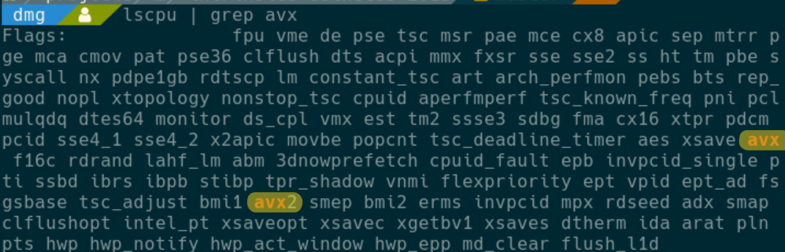
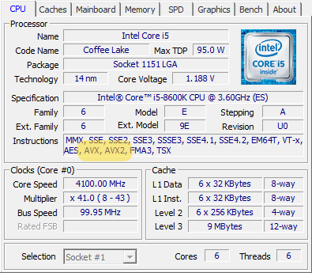

# Intrinsics workshop for CoreCLR 3.0 

Here you'll find a few projects / exercises that demonstrate
various aspects of vectorized AVX2 hardware intrinsics and how to make
use of them in CoreCLR 3.0

## What you need is:
 - CoreCLR 3.0 Installed

    ```bash
    $ dotnet --info | grep sdk | grep 3.0
     Base Path:   /home/dmg/dotnet/sdk/3.0.100/
      3.0.100 [/home/dmg/dotnet/sdk]
    ```

 - Some IDE? ([Jetbrains Rider](https://www.jetbrains.com/rider/) / [Visual Studio 2019 >= 16.3](https://visualstudio.microsoft.com/vs/community/) / [VS Code + C# Extension](https://code.visualstudio.com/download))

 - AVX/AVX2 Enabled CPU:
   
    - Linux:
     
      ```bash
      lscpu | grep avx
      ```
      You should hopefully see:
      
      
    - Windows:
      Install [CPU-Z](https://www.cpuid.com/softwares.html)
      Run it, you should hopefully see:
      
    
